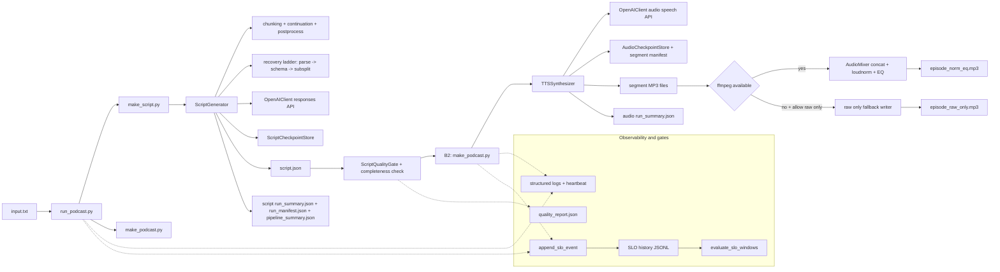

# Podcast Maker

[](https://github.com/tonyredondo/agent-skills/actions/workflows/podcast-maker-tests.yml)

This document describes the production pipeline for script and audio generation.

## Prerequisites

- Run commands from the skill root directory (`.../podcast-maker`).
- `OPENAI_API_KEY` must be set, or available in `~/.codex/auth.json`.
- `ffmpeg` is required for full audio post-processing.
- Python `3.10+` is required.

## Goals

- Stable generation for 5/15/30 minute episodes
- Robust behavior in recommended range 2-60 minutes (best effort outside range)
- Checkpoint + resume for script and TTS
- Strong observability (progress, heartbeat, summaries)
- Single, consistent pipeline

## Architecture diagram



## Main commands

```bash
./scripts/run_podcast.py --profile standard input.txt outdir episode_name
./scripts/make_script.py --profile standard input.txt script.json
./scripts/make_podcast.py --profile standard script.json outdir episode_name
./scripts/make_podcast.sh script.json outdir episode_name --profile standard --resume
```

`make_podcast.py` accepts an optional third positional argument (`basename`) and defaults to `episode` if omitted.
`basename` must be a plain file name (no path separators like `/` or `../`).
Both entrypoints accept `--episode-id` to force a stable run identity across script/audio stages.
When using separate commands, pass the same `--episode-id` to both for clean handoff and artifact grouping.
`make_podcast.sh` is the official wrapper for portable invocation and forwards extra flags to `make_podcast.py`.
Use only flags shown in each script `--help`.

## Script quality gate (pre-audio)

`make_podcast.py` runs a script quality verification step before TTS.

- default mode: `SCRIPT_QUALITY_GATE_ACTION=enforce`
- default evaluator: `SCRIPT_QUALITY_GATE_EVALUATOR=hybrid`
- profile defaults for LLM sampling in hybrid mode:
  - `short`: `SCRIPT_QUALITY_GATE_LLM_SAMPLE=0.5`
  - `standard`/`long`: `SCRIPT_QUALITY_GATE_LLM_SAMPLE=1.0`
- semantic fallback for pattern-based rules (`summary_ok` / `closing_ok`) is enabled by default in all evaluators (`rules`/`hybrid`/`llm`), so language/wording changes do not rely on exact regex matches:
  - `SCRIPT_QUALITY_GATE_SEMANTIC_FALLBACK=1`
  - `SCRIPT_QUALITY_GATE_SEMANTIC_MIN_CONFIDENCE=0.55`
  - `SCRIPT_QUALITY_GATE_SEMANTIC_TAIL_LINES=10`
- when evaluation fails:
  - `enforce`: run exits with code `4`, no TTS call is made
  - `warn`: warning is logged and pipeline continues
  - `off`: gate is skipped
- optional script-stage gate (after `make_script.py` output):
  - `SCRIPT_QUALITY_GATE_SCRIPT_ACTION=off|warn|enforce`
  - profile default when unset:
    - `short`: `warn`
    - `standard`/`long`: `enforce` (early fail to avoid late audio rejection)
  - auto-repair is enabled by default before final decision:
    - `SCRIPT_QUALITY_GATE_AUTO_REPAIR=1`
    - `SCRIPT_QUALITY_GATE_REPAIR_ATTEMPTS=2`
  - monotonic persistence defaults:
    - `SCRIPT_QUALITY_GATE_REPAIR_REVERT_ON_FAIL=1` (keep original if repaired candidate still fails)
    - `SCRIPT_QUALITY_GATE_REPAIR_MIN_WORD_RATIO=0.85` (reject repairs that shrink too much)

Gate artifacts:

- script-stage:
  - `<script_checkpoint_dir>/<episode>/quality_report_initial.json`
  - `<script_checkpoint_dir>/<episode>/quality_report.json`
- audio-stage:
  - `<audio_checkpoint_dir>/<episode>/quality_report.json`
- on success, `podcast_run_summary.json` includes `quality_gate_pass` and `quality_report_path`

Recommended preset for production strictness:

```bash
export SCRIPT_QUALITY_GATE_PROFILE=production_strict
```

`production_strict` defaults:

- script gate defaults to `enforce` (if `SCRIPT_QUALITY_GATE_SCRIPT_ACTION` is not explicitly set)
- pre-audio gate stays `enforce`
- `SCRIPT_QUALITY_GATE_EVALUATOR=hybrid` with `SCRIPT_QUALITY_GATE_LLM_SAMPLE=1.0`
- `SCRIPT_QUALITY_GATE_AUTO_REPAIR=1`
- `SCRIPT_QUALITY_GATE_REPAIR_ATTEMPTS=2`
- stricter quality thresholds and repetition/speaker limits

## Profiles

- `short` -> target ~5 min
- `standard` -> target ~15 min (default)
- `long` -> target ~30 min

Duration policy:

- recommended: 2-60 minutes
- outside range: allowed with warning, not hard-blocked
- source sizing defaults are duration-aware:
  - `short` (~5 min): prefer `max(120, target_words * 0.35)`; default mode is `warn` (enforce threshold `0.22` if `SCRIPT_SOURCE_VALIDATION_MODE=enforce`)
  - `standard` (~15 min): prefer `max(120, target_words * 0.50)`; default mode enforce with hard-block threshold `0.35`
  - `long` (~30 min): prefer `max(120, target_words * 0.60)`; default mode enforce with hard-block threshold `0.45`
- if source metadata includes attribution, keep it explicit in the text (for example: `Autor: ...`, `Autores: ...`, `Author: ...`) so the script can reference the author(s) naturally
- if source includes multiple topics or an explicit index/agenda, include those topic cues in the source so the opening can deliver a short roadmap (for example: `hoy hablaremos de...` then `comenzamos con...`)

Override length controls as needed:

```bash
TARGET_MINUTES=30 WORDS_PER_MIN=130 ./scripts/make_script.py input.txt script.json
```

## Resume

```bash
./scripts/make_script.py --resume input.txt script.json
./scripts/make_podcast.py --resume script.json outdir episode_name
```

If input/config changed and you intentionally want to continue:

```bash
./scripts/make_script.py --resume --resume-force input.txt script.json
```

Current major release uses checkpoint format v3 by default (`CHECKPOINT_VERSION=3`).
Runs/checkpoints from previous major versions are not guaranteed to resume cleanly; regenerate when in doubt.

## Debugging

Common flags:

- `--verbose`
- `--debug`
- `--force-unlock`
- `--dry-run-cleanup`
- `--force-clean` (allow cleanup even for recent failed runs)
- `--allow-raw-only` (audio only; if ffmpeg is missing, produce `_raw_only.mp3`)

Common environment variables:

- Canonical reference: `ENV_REFERENCE.md` (single source for defaults from `config.py` + entrypoints)

- Logging: `LOG_LEVEL`, `LOG_HEARTBEAT_SECONDS`, `LOG_DEBUG_EVENTS`
- Models: `SCRIPT_MODEL`/`MODEL`, `TTS_MODEL`
- Script reasoning effort: `SCRIPT_REASONING_EFFORT=low|medium|high` (default `low`)
- Script style controls:
  - `SCRIPT_TONE_PROFILE=balanced|energetic|broadcast` (default `balanced`)
  - `SCRIPT_TRANSITION_STYLE=subtle|explicit` (default `subtle`)
  - `SCRIPT_PRECISION_PROFILE=strict|balanced` (default `strict`)
  - `SCRIPT_CLOSING_STYLE=brief|warm` (default `brief`)
  - `SCRIPT_STRICT_HOST_ALTERNATION=0|1` (default `1`; enforces strict Host1/Host2 alternation)
- Script retries/timeouts: `SCRIPT_RETRIES`, `SCRIPT_TIMEOUT_SECONDS`
- Script orchestrated retries (entrypoint-level):
  - `SCRIPT_ORCHESTRATED_RETRY_ENABLED=0|1` (default `1`)
  - `SCRIPT_ORCHESTRATED_MAX_ATTEMPTS` (default `2`)
  - `SCRIPT_ORCHESTRATED_RETRY_BACKOFF_MS` (default `400`)
  - `SCRIPT_ORCHESTRATED_RETRY_FAILURE_KINDS` (default `openai_empty_output,invalid_schema,script_quality_rejected,script_completeness_failed`)
- Adaptive script defaults (enabled by default): `SCRIPT_ADAPTIVE_DEFAULTS=0|1`
- Script pre-summary: `SCRIPT_PRE_SUMMARY_TRIGGER_WORDS`, `SCRIPT_PRE_SUMMARY_TARGET_WORDS`, `SCRIPT_PRE_SUMMARY_MAX_ROUNDS`
- Script pre-summary parallelization: `SCRIPT_PRESUMMARY_PARALLEL=0|1`, `SCRIPT_PRESUMMARY_PARALLEL_WORKERS`
- Script repair controls:
  - `SCRIPT_REPAIR_MAX_ATTEMPTS` (schema repair attempts in generator)
  - `SCRIPT_PARSE_REPAIR_ATTEMPTS` (base JSON parse repair attempts in OpenAI client, default `2`)
  - `SCRIPT_PARSE_REPAIR_TRUNCATION_BONUS_ATTEMPTS` (extra attempts when output looks truncated, default `2`)
  - `SCRIPT_PARSE_REPAIR_OUTPUT_TOKENS_GROWTH` (per-attempt repair output growth factor, default `1.35`)
  - `SCRIPT_PARSE_REPAIR_MAX_OUTPUT_TOKENS` (hard cap for parse-repair output budget, default `10000`)
  - `SCRIPT_PARSE_REPAIR_MAX_INPUT_CHARS` (max invalid content chars embedded in repair prompt, default `120000`)
- Script token budgets: `SCRIPT_MAX_OUTPUT_TOKENS_INITIAL`, `SCRIPT_MAX_OUTPUT_TOKENS_CHUNK`, `SCRIPT_MAX_OUTPUT_TOKENS_CONTINUATION`
- Script no-progress tuning: `SCRIPT_MAX_CONTEXT_LINES`, `SCRIPT_NO_PROGRESS_ROUNDS`, `SCRIPT_MIN_WORD_DELTA`
- Reliability v3 feature flags (default enabled):
  - `RUN_MANIFEST_V2=0|1` (run identity + pipeline summary)
  - `SCRIPT_RECOVERY_LADDER_V2=0|1` (chunk subsplit fallback after request/schema failures)
  - `SCRIPT_COMPLETENESS_CHECK_V2=0|1` (internal truncation repair/check before gates)
- Source-to-target validation: `SCRIPT_SOURCE_VALIDATION_MODE=off|warn|enforce`, `SCRIPT_SOURCE_VALIDATION_WARN_RATIO`, `SCRIPT_SOURCE_VALIDATION_ENFORCE_RATIO`
  - default policy (unset): `short=warn(0.35/0.22)`, `standard=enforce(0.50/0.35)`, `long=enforce(0.60/0.45)`
- TTS retries/timeouts/concurrency: `TTS_RETRIES`, `TTS_TIMEOUT_SECONDS`, `TTS_MAX_CONCURRENT`
- TTS voice assignment:
  - `TTS_VOICE_ASSIGNMENT_MODE=auto|role|speaker_gender` (default `auto`)
  - role fallback voices: `TTS_HOST1_VOICE` (default `cedar`), `TTS_HOST2_VOICE` (default `marin`)
  - speaker-name gender hints: `TTS_FEMALE_VOICE` (default `marin`), `TTS_MALE_VOICE` (default `cedar`)
  - generic fallback when role/name is unknown: `TTS_DEFAULT_VOICE` (default Host1 voice)
- TTS cadence controls (all speed values are clamped to `0.25..4.0`):
  - `TTS_SPEED_DEFAULT` (default `1.0`)
  - `TTS_SPEED_INTRO` (default `1.0`, inherits neutral speed)
  - `TTS_SPEED_BODY` (default `1.0`, inherits neutral speed)
  - `TTS_SPEED_CLOSING` (default `1.0`, inherits neutral speed)
  - `TTS_PHASE_INTRO_RATIO` (default `0.15`)
  - `TTS_PHASE_CLOSING_RATIO` (default `0.15`)
  - if a phase speed is invalid (non-numeric/NaN), it falls back to `TTS_SPEED_DEFAULT`
- TTS backoff: `TTS_RETRY_BACKOFF_BASE_MS`, `TTS_RETRY_BACKOFF_MAX_MS`
- TTS watchdog/chunking: `TTS_GLOBAL_TIMEOUT_SECONDS`, `CHUNK_LINES`, `PAUSE_BETWEEN_SEGMENTS_MS`
- TTS optional cross-chunk parallelization: `TTS_CROSS_CHUNK_PARALLEL=0|1`
- OpenAI resilience: `OPENAI_CIRCUIT_BREAKER_FAILURES`
- Cost estimation tuning: `ESTIMATED_COST_PER_SCRIPT_REQUEST_USD`, `ESTIMATED_COST_PER_TTS_REQUEST_USD`
- Script quality gate:
  - `SCRIPT_QUALITY_GATE_PROFILE=default|production_strict` (default `default`)
  - `SCRIPT_QUALITY_GATE_ACTION=off|warn|enforce` (default `enforce`)
  - `SCRIPT_QUALITY_GATE_SCRIPT_ACTION=off|warn|enforce` (default by profile: `short=warn`, `standard/long=enforce`)
  - `SCRIPT_QUALITY_GATE_EVALUATOR=rules|hybrid|llm` (default `hybrid`)
  - `SCRIPT_QUALITY_GATE_LLM_SAMPLE` (profile default: `0.5` short, `1.0` standard/long)
  - `SCRIPT_QUALITY_GATE_SEMANTIC_FALLBACK=0|1` (default `1`; applies to `rules`/`hybrid`/`llm`)
  - `SCRIPT_QUALITY_GATE_SEMANTIC_MIN_CONFIDENCE` (default `0.55`)
  - `SCRIPT_QUALITY_GATE_SEMANTIC_TAIL_LINES` (default `10`)
  - `SCRIPT_QUALITY_GATE_SEMANTIC_MAX_OUTPUT_TOKENS` (default `440`)
  - `SCRIPT_QUALITY_GATE_AUTO_REPAIR=0|1` (default `1`)
  - `SCRIPT_QUALITY_GATE_REPAIR_ATTEMPTS` (default `2`)
  - `SCRIPT_QUALITY_GATE_REPAIR_MAX_OUTPUT_TOKENS` (default `5200`), `SCRIPT_QUALITY_GATE_REPAIR_MAX_INPUT_CHARS`
  - `SCRIPT_QUALITY_GATE_REPAIR_OUTPUT_TOKENS_HARD_CAP` (default `6400`)
  - `SCRIPT_QUALITY_GATE_REPAIR_REVERT_ON_FAIL=0|1` (default `1`)
  - `SCRIPT_QUALITY_GATE_REPAIR_MIN_WORD_RATIO` (default `0.85`)
  - `SCRIPT_QUALITY_MIN_WORDS_RATIO`, `SCRIPT_QUALITY_MAX_WORDS_RATIO`
  - `SCRIPT_QUALITY_MAX_CONSECUTIVE_SAME_SPEAKER`
  - `SCRIPT_QUALITY_MAX_REPEAT_LINE_RATIO`
  - `SCRIPT_QUALITY_REQUIRE_SUMMARY`, `SCRIPT_QUALITY_REQUIRE_CLOSING`
  - `SCRIPT_QUALITY_MIN_OVERALL_SCORE`, `SCRIPT_QUALITY_MIN_CADENCE_SCORE`, `SCRIPT_QUALITY_MIN_LOGIC_SCORE`, `SCRIPT_QUALITY_MIN_CLARITY_SCORE`
  - `SCRIPT_QUALITY_LLM_MAX_OUTPUT_TOKENS` (default `1400`), `SCRIPT_QUALITY_LLM_MAX_PROMPT_CHARS`
- Audio orchestrated retries (entrypoint-level):
  - `AUDIO_ORCHESTRATED_RETRY_ENABLED=0|1` (default `1`)
  - `AUDIO_ORCHESTRATED_MAX_ATTEMPTS` (default `2`)
  - `AUDIO_ORCHESTRATED_RETRY_BACKOFF_MS` (default `1200`)
  - `AUDIO_ORCHESTRATED_RETRY_FAILURE_KINDS` (default `timeout,network,rate_limit`)
- Full orchestrator:
  - `RUN_PODCAST_SCRIPT_ATTEMPTS` (default `1`, retries script stage in `run_podcast.py`)
- Audio fallback: `ALLOW_RAW_ONLY=1`
- Cleanup/retention: `RETENTION_CHECKPOINT_DAYS`, `RETENTION_LOG_DAYS`, `RETENTION_INTERMEDIATE_AUDIO_DAYS`
- Disk/budget guardrails: `MIN_FREE_DISK_MB`, `MAX_CHECKPOINT_STORAGE_MB`, `MAX_LOG_STORAGE_MB`, `MAX_REQUESTS_PER_RUN`, `MAX_ESTIMATED_COST_USD`

SLO gate env (optional):

- `SLO_GATE_MODE=off|warn|enforce` (default `warn`)
- `SLO_WINDOW_SIZE=20`
- `SLO_REQUIRED_FAILED_WINDOWS=2`
- `SLO_HISTORY_PATH=./.podcast_slo_history.jsonl`
- `ACTUAL_COST_USD` (optional; enables cost estimation error KPI)

Run summaries are saved under checkpoint directories.
`stuck_abort` is inferred from structured failure signals (`error_kind` in TTS and run summaries in script), not text matching.
SLO events include `failure_kind` for faster triage in rollbacks and runbooks
(including `script_quality_rejected` when the pre-audio gate blocks synthesis and `source_too_short` when source validation enforce blocks script generation).
Run summaries also include `phase_seconds` (including `generation`, `quality_eval`, `repair`) and source validation metrics (`source_word_count`, `source_to_target_ratio`, `target_word_range`).
TTS summaries/manifests include cadence observability fields: `tts_phase_counts`, `tts_speed_stats`, `tts_phase_speed_stats`.
The speech endpoint currently does not use SSML/pitch controls in this flow; expressiveness is tuned with per-line `instructions` plus per-segment `speed`.
Each script run also writes `run_manifest.json` and `pipeline_summary.json` under `<script_checkpoint_dir>/<episode_id>/` with per-stage status (`script`, `audio`, `bundle`) and explicit states (`not_started`, `started`, `running`, `partial`, `interrupted`, `failed`, `completed`).
Run summaries include handoff and audio-state markers (`handoff_to_audio_started`, `handoff_to_audio_completed`, `audio_executed`, `audio_stage`) where `audio_stage` can be `not_started`, `started`, `completed`, `failed_before_tts`, or `failed_during_tts`.

Recommended cadence presets by duration profile:

- `short`: start neutral first (`TTS_SPEED_INTRO=1.0`, `TTS_SPEED_BODY=1.0`, `TTS_SPEED_CLOSING=1.0`)
- `standard`: keep neutral unless voice quality is already validated (`1.0`, `1.0`, `1.0`)
- `long`: only tune if needed and in small steps (`0.98`-`1.02` range recommended)
- If voices sound robotic with phase speed changes, keep all three phase speeds at `1.0`.

## Debug bundle export

Create an operation-ready ZIP with script/audio checkpoints, summaries, optional logs and metadata:

```bash
python3 ./scripts/export_debug_bundle.py episode_name \
  --script-checkpoint-dir ./.script_checkpoints \
  --audio-checkpoint-dir ./out/.audio_checkpoints \
  --script-path ./script.json \
  --source-path ./source.txt \
  --log-path ./podcast_run_logs.txt
```

The command outputs the generated ZIP path and includes:

- `debug_bundle_metadata.json` (safe env snapshot, included/missing files, invocation, effective params, skill version, git commit if available, `resolved_episode_id`, `collection_complete`, and `collection_status_counts`)
- `debug_bundle_tree.txt` (quick tree view)
- `collection_report.json` (per-candidate status: `found`, `missing`, `read_error`, `not_applicable`)
- available run artifacts (`script_checkpoint.json`, `run_summary.json`, `run_manifest.json`, `pipeline_summary.json`, `audio_manifest.json`, `podcast_run_summary.json`, `quality_report.json`)

## Input encoding fallback

Script input loader tries, in order:

- `utf-8`
- `utf-8-sig`
- `cp1252`
- `latin-1`

This avoids hard failures for common non-UTF8 text sources.

## Golden regression gate

Run before promoting rollout stages:

```bash
python3 ./scripts/run_golden_pipeline.py --candidate-dir ./.golden_candidates
python3 ./scripts/check_golden_suite.py --candidate-dir ./.golden_candidates
```

Notes:

- `run_golden_pipeline.py` requires valid OpenAI credentials and sources that satisfy current source-validation policy for requested targets.
- When local auth/network or source sizing constraints block candidate generation, use fixture fallback in the checker for deterministic structural regression validation:
  - `python3 ./scripts/check_golden_suite.py --allow-fixture-fallback`

Useful options:

- `run_golden_pipeline.py`: `--cases-path`, `--stop-on-error`, `--report-json`, `--debug`
- `check_golden_suite.py`: `--fixtures-dir`, `--baseline-path`, `--json-out`, `--allow-fixture-fallback`

The suite validates structural quality against:

- `tests/fixtures/golden/*.json`
- `tests/fixtures/golden/baseline_metrics.json`
- source corpus: `tests/fixtures/golden/sources/*.txt`
- case manifest: `tests/fixtures/golden/cases.json`

Local/offline sanity checks can use fixture fallback when candidates are missing:

```bash
python3 ./scripts/check_golden_suite.py --allow-fixture-fallback
```

